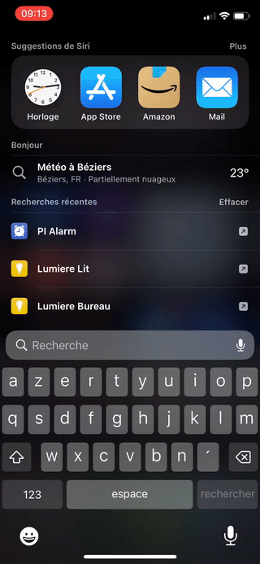
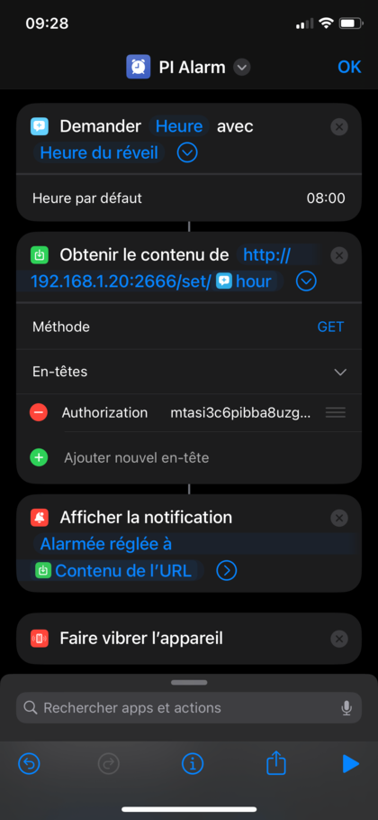

# pi-alarm

A simple alarm clock for the Raspberry Pi, with a shortcut to set the alarm time, and a web interface to stop the alarm.

**I'm hard to wake up in the morning (😶‍🌫️), so I made this alarm clock to help me.
It's a personal project and coded very quickly to meet a single need. If you use it, don't make a PR, just fork it and use it as you want.**

-   [ ] Add 5+ challenges
-   [ ] Control sounds playlist from shortcut
-   [ ] Turn on my lights when the alarm rings
-   [ ] Fix some bugs (From `load_dotenv`)

## Shortcut (IOS)

[https://www.icloud.com/shortcuts/4728239e7c5b4ad8afed1ba31e11c248](https://www.icloud.com/shortcuts/4728239e7c5b4ad8afed1ba31e11c248)

<table>
  <tr>
    <td valign="top"></td>
    <td valign="top"></td>
  </tr>
</table>

## Details

### Interface

-   http://[IP_ADDRESS]:2666/[TOKEN]

### API

-   Endpoints are defined in `/alarm/http.py`

### Files

-   `/alarm`: Source code of the alarm clock
-   `/docs`: Files for the README.md
-   `/challenges`: Html files for the challenges (Web interface to stop the alarm)
-   `/sounds`: Sounds for the alarm clock (Only `*.mp3` files are supported)
-   `.env.example`: Copy this file to `.env` and set your own values

## License

MIT
